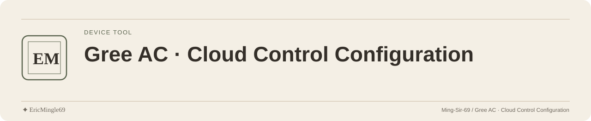

<picture>
  <source media="(prefers-color-scheme: dark)" srcset="readme-assets/header-dark.svg">
  <source media="(prefers-color-scheme: light)" srcset="readme-assets/header-light.svg">
  
</picture>

<p align="center">
  <a href="README.md">简体中文</a> · <a href="README.en.md">English</a> · <a href="PERSONAL-NOTICE.md">✦ EricMingle69</a>
</p>

# Gree AC · Cloud Control Configuration

A Python / Docker project that calls an infrared air-conditioner controller through Tuya cloud APIs.
It changes temperatures or switches off according to existing time rules, for maintainers authorized to control the account and device.

## Read implementation before configuring

| File | Purpose |
| --- | --- |
| [ac_final.py](ac_final.py) | Cloud APIs, time rules, mode switching and scheduler |
| [docker-compose.yml](docker-compose.yml) | Container, timezone, logs and environment parameters |
| [Dockerfile](Dockerfile) | Python 3.11 and requests dependency |
| [.env.example](.env.example) | Local configuration format |

Use only devices and accounts you own or are explicitly authorized to control.
There is no separate simulation-only entry; starting the program sends real device commands.

## Checks before startup

1. Prepare a local `.env` using `.env.example` and your authorized configuration.
2. Check that device identifiers, Tuya API permissions, network and configured targets agree.
3. Review the schedule in `get_mode()` and adapt it to the authorized use.
4. Check timezone, temperature, mode, fan speed and trigger settings before starting.

Keep real credentials out of the repository, screenshots and public logs.

## Existing command-line entries

```sh
docker-compose up -d
docker-compose logs -f
docker-compose down
```

Logs help inspect configuration and API responses; they do not prove that the physical device acted.

## Current scheduling parameters

`TRIGGER_TIME=00:30` uses `MM:SS` with minutes modulo 5: the preferred window in a five-minute cycle, not midnight.
`TRIGGER_WINDOW=2` provides second-level tolerance; `FALLBACK_RATIO=1.3` defines the timeout retry multiplier.
`OFF_CHECK_INTERVAL=30` is in minutes for independent off checks; mode changes can also trigger immediate handling.
These mechanisms do not guarantee a fixed response delay; older `01:00` descriptions do not replace current configuration.

## License and control permission

No LICENSE/NOTICE covers the original code; confirm its reuse scope.
Personal documentation maintenance does not grant account or device control rights; assess operational permission separately from software licensing.

---

Documentation maintained by **✦ EricMingle69** · [Ming-Sir-69](https://github.com/Ming-Sir-69)  
[Personal identity, licensing and permissions](PERSONAL-NOTICE.md) · The header follows your GitHub theme.
